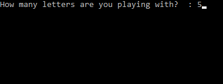

# Example 1:

#### Start with a blank wordle puzzle:

#### Make your first guess, choosing a good start word such as `stern`.

#### Launch your `WordleSolver.exe` application on your computer and select the proper number of letters to load the dictionary.

#### Exclude the letters in grey by entering the search string like this:

#### Include/exclude letters in another search string (orange letters are lowercase, green letters are uppercase):

#### Press option `S`, note how many possible solutions we have left.

#### That's too many options to accurately guess, let's try another word in the puzzle to further narrow down our solution.

#### Update our searchable list using the color codes (`.udi` and `a___t`). Then use the `P` option to print the list of possible solutions.

#### Choose from this list for the next guess.

#### **Good work!**