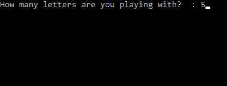

# Example 1:
Start with a blank wordle puzzle:

Make your first guess, choosing a good start word such as `stern`.

Launch your `WordleSolver.exe` application on your computer and select the proper number of letters to load the dictionary.

Exclude the letters in grey by entering the search string like this:

Include/exclude letters in another search string (orange letters are lowercase, green letters are uppercase):

Press `S` in your solver, note how many possible solutions we have left. Let's try another word in the puzzle to further narrow down our solution.

Update our searchable list using the color codes (`.audo` and `___i_`). Then use the `P` option to print the list of possible solutions. Choose from this list for the next guess.

Let's try the word `flint` and see what happens.

So close! Use option `P` again to pick the best option, but don't forget to exclude `F` by entering the search string `.f`

**Good work!**